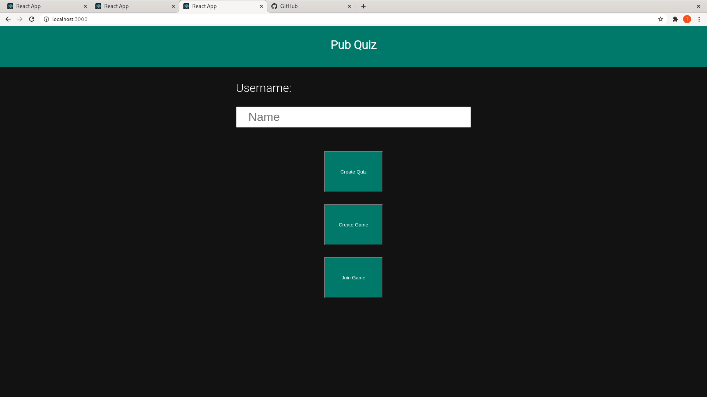
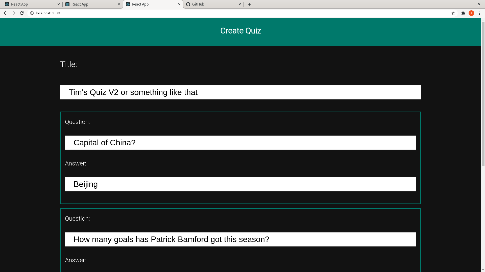
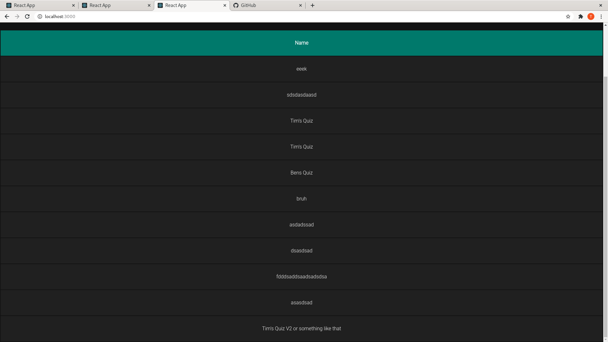
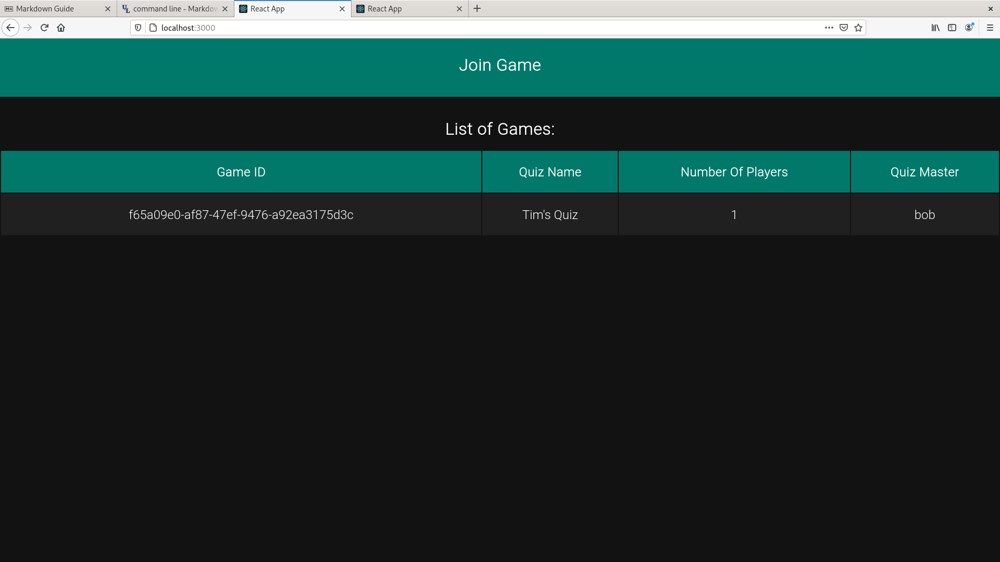
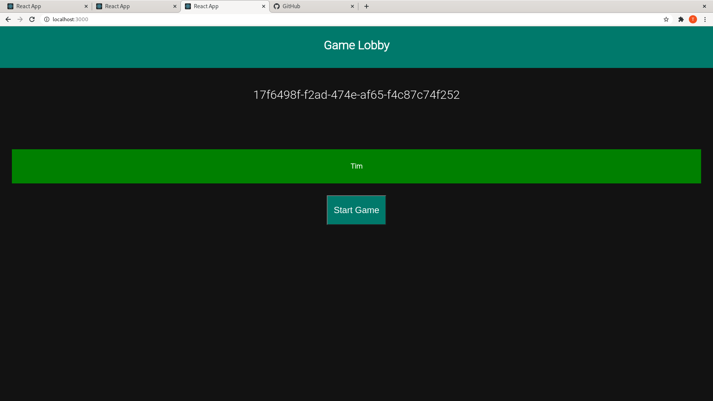
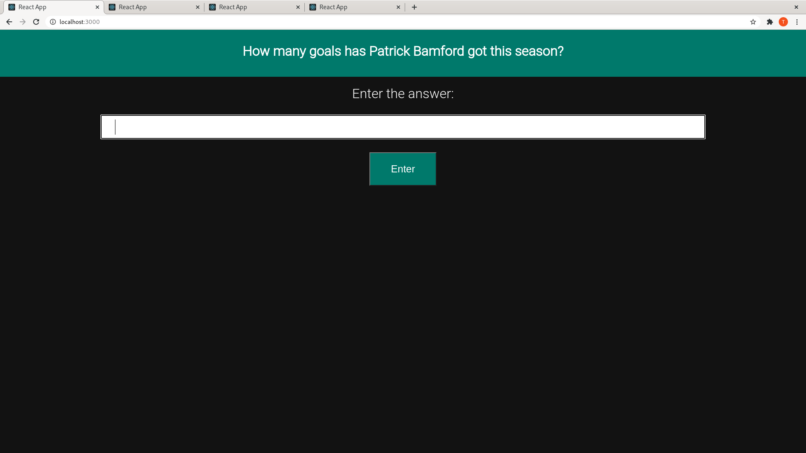
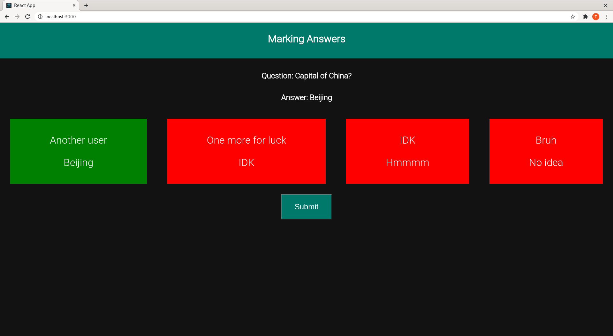
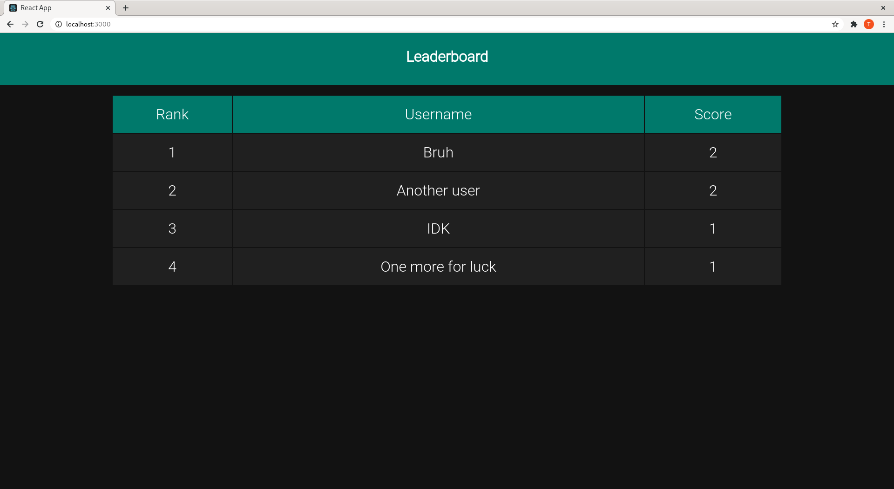

# Pub Quiz Implementation Using React

The project shows my implementation of a pub quiz using React.JS, Express, MongoDB and Socket.IO.
The beauty of the quiz is that any question can be asked. It relies on one user dedicated themselves
as a marker to mark the questions the other users have answered.

An alternative approach would be to use multiple choice questions but this does not properly simulate
a pub quiz as it gives the answer aways.

## The Main Menu

## Creating A Quiz

## Creating A Game

## Joining A Game

## The Game Lobby

## Answering A Question

## Marking A Question

## The Leaderboard

